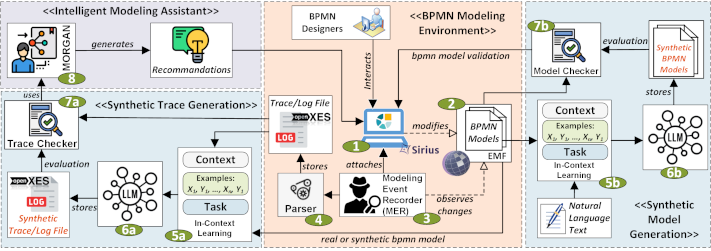

# ***BP-MASTER-LLM***: a model-driven framework to support ***B***usiness ***P***rocess ***M***anagement ***A***ctivities using ***S***ynthetic ***T***race g***E***neration of modeling ope***R***ations through ***LLM***

This repository presents our proposed approach and the corresponding replication package. The core concept involves integrating a Modeling Event Recorder (MER) framework within the "BPMN Designer" Modeling System Environment. This framework captures and traces designer activities and modeling steps. Subsequently, it injects these events into Intelligent Modeling Assistants (IMAs), enabling the generation of personalized suggestions for BPMN modeling actions most relevant to each designer. The software architecture is shown in the Figure below.

The repository is organized as follows:

1. **01-02-03 BPMN Designer** contains the BPMN Designer Graphical Modeling Workbench with the Modeling Event Recorder (MER).
4. **04 Trace Parser**: This folder contains the results of parsing the MER tracing files for each BPMN model;
5. **05-06-07 (a)(b) LLM Synthetic Dataset**: This folder contains two sub-folders for trace and model generation as follows:
	- **D2 Trace Synthetic Dataset**: This contains the prompt schemas used and the results of the queries made to the considered LLMs from real and synthetic BPMN models;
	- **D2 Model Synthetic Dataset**: This contains the prompt schemas used and the results of the queries made to the considered LLMs for generating synthetic BPMN models;
6. **08 Trace Quality Checker**: This folder contains the Python code for extracting metrics related to the correctness, diversity, and hallucination of synthetic traces, along with the corresponding Jamovi projects for statistical analyses in the results_RQ1 folder for BPMN Designer;
8. **09 IMA**: This folder contains MORGAN, the recommender system used in this work, with two folders containing the results related to RQ2 and RQ3 for BPMN Designer.

### RELEASE NOTES
Latest Release: 1.0.0
 
### LICENSE
GNU GENERAL PUBLIC LICENSE Version 2, June 1991 (see [https://www.gnu.org/licenses/gpl-2.0.en.html](https://gnu.org/licenses/old-licenses/gpl-2.0.html))
 
### DEVELOPER RESOURCES
Source Repositories: [https://github.com/hepsycode/BP-MASTER-LLM-CAiSE.git](https://github.com/hepsycode/BP-MASTER-LLM-CAiSE.git)

- Clone: 
    - https: [https://github.com/hepsycode/BP-MASTER-LLM-CAiSE.git](https://github.com/hepsycode/BP-MASTER-LLM-CAiSE.git)
 
You can use the code from these repositories to experiment, test, build, and create patches, and issue pull requests (only by request).
For any bug or doubt, contact us or open an issue.
 
### SUPPORT
We currently support: 

 1. Email: 
    - Vittoriano Muttillo:
       - vittoriano.muttillo@guest.univaq.it,
       - vmuttillo@unite.it
       - vittoriano.muttillo@gmail.com
    - Claudio Di Sipio
       - claudio.disipio@univaq.it
    - Riccardo Rubei
       - riccardo.rubei@univaq.it
    - Luca Berardinelli
       - luca.berardinelli@jku.at
    - Romina Eramo
       - reramo@unite.it
 2. Issues on GitHub

## Additional information
Research publications are available at https://hepsycode.github.io/
